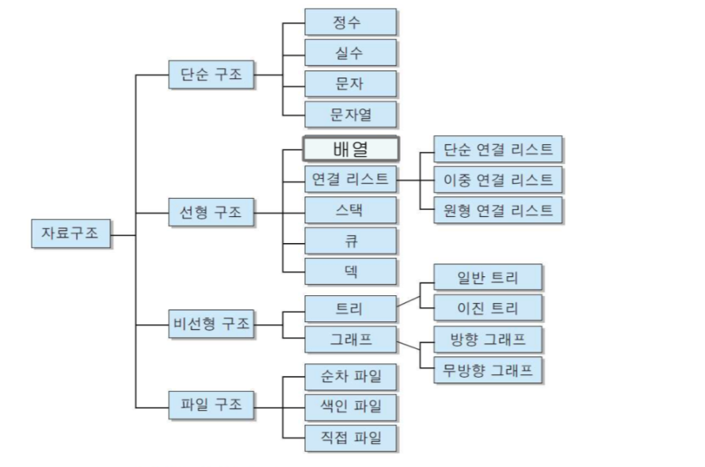

# 1일차: 자료 구조와 알고리즘 소개, 선형 자료구조(스택, 큐)

## 목차

- [학습 목표](#학습-목표)
- [자료 구조](#자료-구조)
  - [정의](#정의)
  - [종류](#종류)
- [알고리즘](#알고리즘)
  - [정의](#정의-1)
  - [수행시간](#수행시간)
  - [조건](#조건)
- [선형 자료구조: 스택(Stack)](#선형-자료구조-스택stack)
  - [정의](#정의-2)
  - [연산](#연산)
  - [구현](#구현)

### 학습 목표

- 자료 구조와 알고리즘 소개
- 선형 자료구조(스택, 큐)

### 자료 구조

#### 정의

자료(Data)를 효율적으로 사용하기 위해 자료의 특성에 따라서 분류하여 구성하고 저장 및 처리하는 모든 작업을 의미한다.

일반적으로 데이터는 단일 데이터를 의미한다. 예를 들어 숫자를 저장하는 변수가 있다.

반대로 자료 구조는 여러 가지 자료들을 효율적으로 저장하는 구조를 의미한다.

이때 자료 구조를 잘 써야 하는 가장 큰 이유는 원하는 데이터를 빨리 찾을 수 있기 때문이다.

#### 종류



여러 종류의 자료 구조가 존재하기 때문에 상황에 맞게 잘 사용해야 한다.

##### 단순 구조

- 정수, 실수, 문자, 문자열 등의 기본 자료형이다.
- Python과 달리 C/C++, Java 등의 언어에서는 자료형을 선언해야 한다.

##### 선형 구조

- 자료들 간의 앞뒤 관계가 1:1의 선형 관계인 자료 구조이다.
- 배열, 리스트, 스택, 큐, 덱 등이 있다.
- Python의 리스트, 튜플이 대표적인 선형 구조이다. 이때 리스트는 단순 연결 리스트다.
- 단순 연결 리스트의 경우 정해진 방향성을 가지고 있는데 예를 들어 Python의 리스트의 경우 좌측에서 우측으로만 데이터를 입력 가능하기 때문에 좌측에 새로 데이터를 입력하기 위해서는 해당 위치 기준의 우측에 위치한 모든 데이터를 한 칸씩 우측으로 미뤄야한다.
- 이중 연결 리스트의 경우 단순 연결 리스트와 달리 좌측에서 우측은 물론 우측에서 좌측 방향도 가능하다. 양 방향성이 다 가능하다는 의미다.
- 원형 연결 리스트의 경우 첫 번째 인덱스 요소와 마지막 인덱스 요소가 연결되어 원형으로 이어지는 자료 구조다.
- 스택, 큐, 덱의 경우 저장되는 데이터의 규칙성이 있다. 순서가 있다는 점이다.

##### 비선형 구조

- 자료들 간의 앞뒤 관계가 1:N 또는 N:M의 관계이다.
- 대표적으로 트리, 그래프 등이 있다.
- 트리가 대표적인 1:N 관계의 자료 구조이다. 파이썬의 딕셔너리가 이에 해당한다.
- 네비게이션과 같이 어떤 목적지와 어떤 목적지 사이의 갈 수 있는 경로들에 대해 다루는 자료 구조는 그래프다.

##### 파일 구조

- 레코드의 집합인 파일에 대한 자료 구조이다.
- 대표적으로 순차 파일, 색인 파일, 직접 파일 등이 있다.
- 일반적으로 사용하지는 않지만 가장 복잡한 구조로 데이터를 저장할 때 사용한다.

### 알고리즘

#### 정의

어떤 문제를 해결하기 위해 명확히 정의된 유한 개의 규칙들의 집합을 의미한다.

쉽게 한정된 규칙을 적용함으로써 문제를 해결하는 것을 의미한다.

같은 결과를 구하는 처리에서도 알고리즘의 좋고 나쁨에 따라 시간이나 조작성에 큰 차이가 있기 때문에 알고리즘이 중요하다.

#### 수행시간

알고리즘의 효율성을 따질 때는 일반적으로 무한한 입력에 대해 따진다.

#### 조건

##### 입력

- 외부 입력자료가 있을 수 있다.

##### 출력

- 하나 이상의 결과가 나온다.

##### 명확성

- 각 명령(연산)들은 명확한 의미를 가져야 한다.

##### 효율성

- 모든 명령들은 실행 가능하고 수행 시간이 짧을수록 좋다.

##### 종결성(유한성)

- 유한 번의 연산 후에는 끝나야 한다.

### 선형 자료구조: 스택(Stack)

#### 정의

접시를 쌓듯이 자료를 차곡차곡 쌓아 올린 형태의 자료 구조이다.

스택에 저장된 원소는 탑(Top)으로 정한 곳에서만 접근 가능하다.

탑의 위치에서만 원소를 삽입하므로 먼저 삽입한 원소는 밑에 쌓이고 나중에 삽입한 원소는 위에 쌓이는 구조다.

이를 후입선출, 다시 말해 LIFO(Last In First Out) 구조라 한다.

#### 연산

삽입 연산(`push`)과 삭제 연산(`pop`)이 존재한다.

#### 구현

##### C언어 배열을 이용한 구현

- 순차 자료 구조인 1차원 배열을 이용하여 구현한다.
- 스택의 크기는 곧 배열의 크기다.
- 스택에 저장된 원소의 순서는 배열 원소의 인덱스와 같다. 다시 말해 인덱스 0번은 스택의 첫 번째 원소이고 인덱스 N-1번은 스택의 N번째 원소이다.
- 변수 `top`을 선언하여 스택에 저장된 마지막 원소에 대한 인덱스를 저장한다. 스택이 비어 있는 경우 변수 `top`의 값은 초기값인 -1이며 정해진 배열의 크기 N에 대해 모든 인덱스에 요소가 전부 들어가 있는 경우 변수 `top`의 값은 N-1이다.
- 변수 `top`을 선언하는 이유는 그 위치를 기준으로 다음 값을 삽입하거나 이전 값을 삭제할 수 있기 때문이다.

```C
#include <stdio.h>
#define STACK_SIZE 3

typedef int element;
element stack[STACK_SIZE];
int top = -1;

void push(element item) {
    if (top == STACK_SIZE - 1) {
        printf("\nStack is full!\n");
        return;
    } else {
        stack[++top] = item;
    }
}

element pop() {
    if (top == -1) {
        printf("\nStack is empty!\n");
        return 0;
    } else {
        return stack[top--];
    }
}

element peek() {
    if (top == -1) {
        printf("\nStack is empty!\n");
        return 0;
    } else {
        return stack[top];
    }
}

void del() {
    if (top == -1) {
        printf("\nStack is empty!\n");
    } else {
        top--;
    }
}

void printStack() {
    int i;
    printf("\nSTACK [ ");
    for (i = 0; i <= top; i++) {
        printf("%d ", stack[i]);
    }
    printf("]\n");
}
```

##### Python 클래스와 리스트를 이용한 구현

```Python
class Stack:
    def __init__(self, size: int) -> None:
        self.limit_size: int = size
        self.current_size: int = 0
        self.stack: list[int] = []

    def __call__(self) -> None:
        print(self.stack)

    def push(self, value: int) -> None:
        if self.current_size == self.limit_size:
            print("Stack is full!")

        else:
            self.current_size += 1
            self.stack.append(value)
            print(f"{value} inserted")

    def pop(self) -> None:
        if self.current_size == 0:
            print("Stack is empty!")

        else:
            self.current_size -= 1
            top: int = self.stack.pop()
            print(f"{top} deleted")
```
